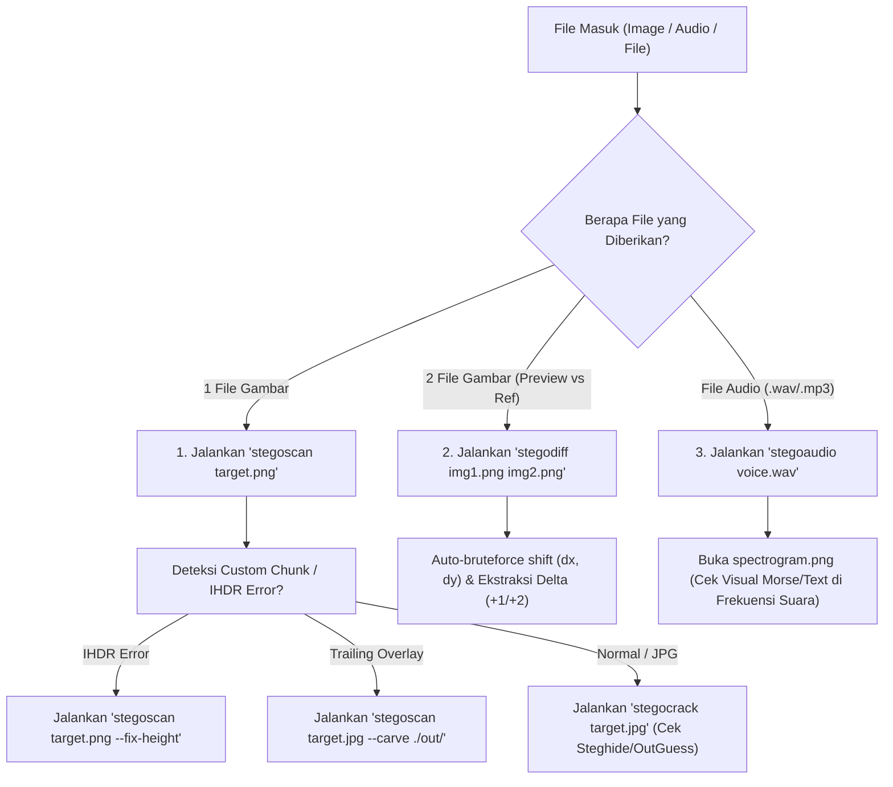

#  Modul Steganography & Artifact Triage (`stego/`)

Suite terintegrasi untuk mendiagnosa, mengekstrak, dan memecahkan berbagai lapisan steganografi di file gambar, audio, dan biner (*PNG Custom Chunks, 2D Spatial Shift Alignment, EXIF, Trailing Overlays, Steghide/OutGuess Cracker, dan Audio FFT Spectrogram*).

---

##  Daftar Tools & Perintah

### 1. `stegoscan` — Structural & Chunk Integrity Scanner
Mendiagnosa integritas struktural file biner dan gambar:
- **Deteksi Chunk PNG Non-Standar:** Menemukan chunk custom seperti `raCh`, `prIv`, `mkEr` beserta kalkulasi CRC32.
- **Auto-Fix PNG IHDR Height Tampering:** Memperbaiki tinggi gambar yang sengaja dipotong hacker berdasarkan CRC checksum header (`--fix-height`).
- **Trailing Overlay Detection:** Menemukan data sampah/file rahasia yang diselipkan setelah marker akhir file (`IEND` untuk PNG, `FF D9` untuk JPG).
- **Auto-Carver:** Mengekstrak arsip tersembunyi (ZIP, 7z, RAR, GZ, PDF, PE, ELF) (`--carve <dir>`).
- **Metadata Inspection:** Memeriksa tag EXIF, komentar, dan string Base64 tersembunyi.

```bash
# Diagnosa struktur & custom chunks:
stegoscan image.png

# Perbaiki tinggi gambar PNG yang terpotong (IHDR mismatch):
stegoscan image.png --fix-height

# Ekstrak trailing overlay & embedded ZIP/PE:
stegoscan suspicious.jpg --carve ./extracted/

# Scan mendalam multi-plane zsteg:
stegoscan image.png --deep
```

---

### 2. `stegodiff` — 2-Image Spatial Differential & Matrix Shift Analyzer
Dirancang khusus untuk menganalisis 2 file gambar (misal: *Restoration Preview vs Reference*):
- **Auto-Bruteforce 2D Shift Alignment:** Menemukan pergeseran koordinat matriks piksel $(dx, dy)$ dari $-15$ hingga $+15$ untuk menemukan alignment yang identik.
- **Residual Delta Decoder:** Menganalisis selisih aritmatika piksel ($\Delta = 1, 2$) dan otomatis mengonversinya menjadi bitstream biner / teks ASCII.
- **Border Modulation Detection:** Memindai baris $y=0$ dan kolom $x=0$ untuk mengekstrak bitstream modulasi.
- **Visual Diff Generator:** Menyimpan gambar selisih piksel XOR dan subtraction (`--save-diff <dir>`).

```bash
# Bandingkan dua gambar dan cari shift alignment terbaik:
stegodiff scan_042_preview.png scan_042_reference.png

# Simpan hasil visual difference:
stegodiff scan_042_preview.png scan_042_reference.png --save-diff ./diff_out/
```

---

### 3. `stegocrack` — Steganography Password Cracker
Otomasi ekstraksi payload tersembunyi ber-password:
- **Steghide Auto-Bruteforce:** Mencoba password kosong (*blank password*), nama file, dan *top common CTF passwords*.
- **Dictionary Attack:** Mendukung wordlist kustom (`-w /usr/share/wordlists/rockyou.txt`).
- **OutGuess Auto-Extractor:** Otomasi ekstraksi algoritma OutGuess.

```bash
# Coba ekstrak otomatis (blank & common passwords):
stegocrack secret.jpg

# Bruteforce dengan wordlist rockyou:
stegocrack secret.jpg -w /usr/share/wordlists/rockyou.txt -o ./flag.txt
```

---

### 4. `stegoaudio` — Audio Spectrogram & LSB Visualizer
Menganalisis file audio (`.wav`, `.mp3`, `.ogg`, `.flac`):
- **High-Res FFT Spectrogram:** Menghasilkan gambar spektrum frekuensi suara resolusi tinggi untuk mengungkap teks, gambar, atau kode Morse yang digambar di frekuensi audio.
- **WAV LSB Extractor:** Mengekstrak bit paling tidak signifikan dari uncompressed audio sample (`--lsb`).

```bash
# Generate spectrogram resolusi tinggi:
stegoaudio recording.wav -o ./spectrogram.png

# Gunakan colormap magma / viridis:
stegoaudio sound.mp3 --cmap magma

# Ekstrak data LSB:
stegoaudio voice.wav --lsb
```

---

##  CTF Final Stego Quick Decision Tree (Playbook Lomba)

Gunakan alur cepat ini saat menghadapi soal Steganografi di babak Final:



###  Pro-Tips Tambahan:
1. **Jika file JPG:** Prioritaskan `stegoscan` (cek trailing ZIP past `FF D9`) $\rightarrow$ lalu `stegocrack` (Steghide blank/common password).
2. **Jika file PNG:** Prioritaskan `stegoscan` (cek custom chunk non-standar & perbaiki IHDR height) $\rightarrow$ lalu `stegoscan --deep` (zsteg).
3. **Jika ada 2 file gambar mirip:** Jangan buang waktu manual, langsung `stegodiff target.png baseline.png` untuk auto-matrix alignment!
4. **Jika file WAV/Audio:** Langsung `stegoaudio sound.wav` untuk melihat gelombang frekuensi FFT.

